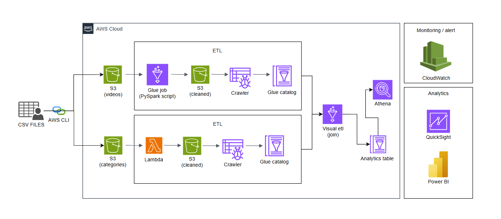

# Building a Serverless Data Pipeline on AWS to Analyze YouTube Trends (ETL, Glue, Athena, QuickSight)

In this project, I focused on building a serverless, production-ready ETL pipeline on AWS to process and analyze YouTube Trending data. My goal was to transform raw CSV and JSON files into a clean, queryable dataset that could power dashboards and insights.

## Read the Full Project Story

For a detailed walkthrough of this project, including architecture, tools, challenges, and learnings, check out my [Medium article here](https://medium.com/@houamrha/building-a-serverless-data-pipeline-on-aws-to-analyze-youtube-trends-etl-glue-athena-b898493ec841).

## Project Architecture

